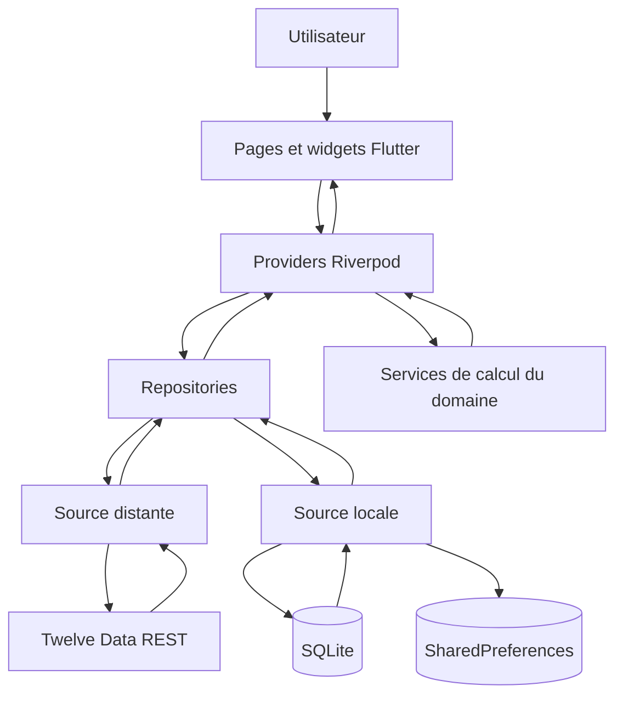
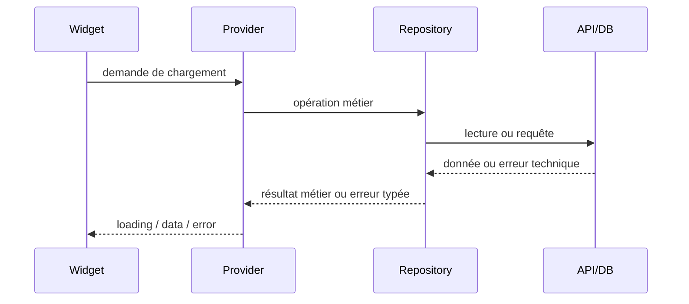

# Architecture logicielle

## Décision

**[IMPOSÉ — SUJET]** L'interface, la gestion d'état, la logique métier, les données distantes et la persistance locale doivent être séparées de façon cohérente et explicable.

**[DÉCIDÉ — FINDECK]** FinDeck adopte une architecture en couches, volontairement simple pour un projet universitaire :

1. `features/` : pages, widgets et providers propres à une fonctionnalité ;
2. `domain/` : modèles et calculs métier sans dépendance visuelle ;
3. `data/` : API, base locale, DTO, mapping et repositories ;
4. `core/` : éléments techniques réellement partagés ;
5. `app/` : démarrage, thème et navigation.

L'objectif n'est pas d'accumuler des interfaces abstraites, mais de rendre chaque responsabilité testable et défendable.

## Diagramme d'architecture



## Responsabilités

| Couche | Fait | Ne fait pas |
|---|---|---|
| UI | Affiche l'état, collecte les actions, navigation, animation | Appeler l'API, écrire en DB, calculer la performance |
| Riverpod | Expose l'état asynchrone/métier, orchestre les actions | Parser du JSON, exécuter du SQL dans un provider |
| Domaine | Modèles stables, règles et calculs purs | Dépendre de Flutter, Dio ou sqflite |
| Repository | Choisit distant/local, applique la stratégie de cache, mappe les erreurs | Construire des widgets |
| Source distante | Requêtes HTTP, statut HTTP, JSON/DTO | Décider seule de la politique hors ligne |
| Source locale | Requêtes SQLite, transactions locales, métadonnées de cache | Décider de la présentation |
| App/Core | Routeur, thème, configuration et outils partagés | Absorber toute la logique fonctionnelle |

## Règle de dépendance

```text
UI -> état -> contrats/repositories + domaine
data -> domaine
domain -> aucune dépendance Flutter/data
```

Les dépendances vont vers les concepts stables. Un écran ne reçoit jamais un client Dio ou une base SQLite.

## Qui prend quelle décision ?

- Le **Widget** décide uniquement quoi afficher pour l'état reçu.
- Le **provider/notifier Riverpod** décide quelle action applicative lancer et publie le nouvel état.
- Le **repository** décide si le résultat vient de l'API, du cache ou d'un repli après erreur.
- La **source distante** sait communiquer avec l'API et convertir la réponse brute en DTO.
- La **source locale** sait lire et écrire le stockage.
- Le **service du domaine** effectue les calculs financiers.

## Propagation d'une erreur



Une erreur réseau n'efface pas un cache valide. Si une donnée locale exploitable existe, le repository la retourne avec son horodatage et une indication de fraîcheur ; sinon l'erreur remonte jusqu'à un état affichable et réessayable.

## Pourquoi cette architecture ?

- elle répond directement au critère d'architecture du sujet ;
- elle rend les calculs testables sans Widget ;
- elle centralise le comportement offline dans le repository ;
- elle permet de remplacer Twelve Data sans réécrire les écrans ;
- elle limite le travail effectué lors d'un rebuild Flutter ;
- elle reste plus simple qu'une Clean Architecture exhaustive.

## Points encore ouverts

**[À DÉCIDER]** L'usage ou non de génération de code Riverpod/JSON, la forme exacte des contrats de repository et la bibliothèque éventuelle de modèles immuables seront choisis au moment du scaffold. Aucun de ces choix ne doit modifier les responsabilités ci-dessus.
