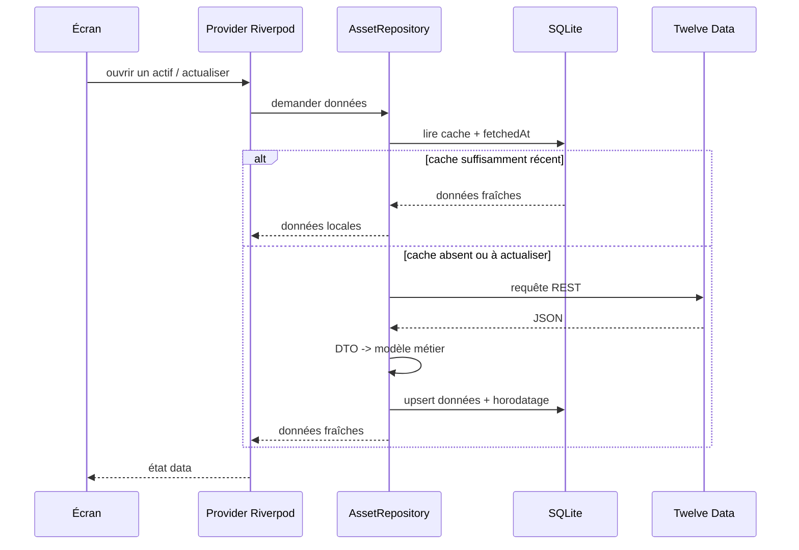
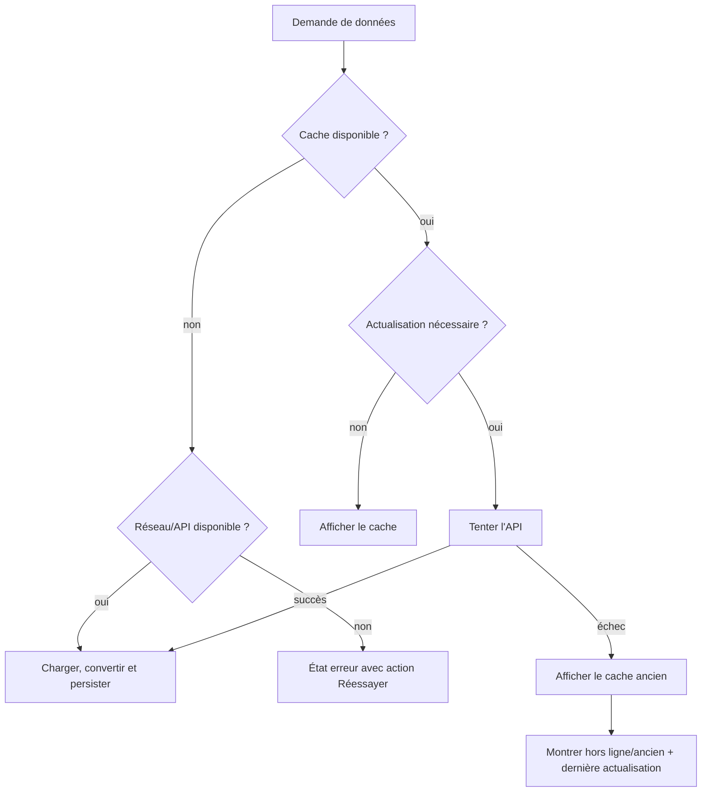

# Flux de données, cache et mode hors ligne

## Principe

**[IMPOSÉ — SUJET]** Les données Internet pertinentes doivent être mises en cache, les appels inutiles évités et l'application doit garder un intérêt sans réseau, y compris après fermeture complète.

**[DÉCIDÉ — FINDECK]** Le repository est l'unique arbitre entre API et stockage local. Les données utilisateur sont locales et durables ; les données de marché sont des copies horodatées pouvant devenir anciennes.

## Lecture avec réseau

Pour une bonne réactivité, une variante « cache puis actualisation » peut afficher immédiatement le cache et signaler `refreshing` pendant la requête. Ce comportement doit être cohérent dans toute l'application.

## Échec réseau ou absence de connexion

Le repli fonctionne après redémarrage parce que le cache est dans SQLite, pas uniquement en mémoire.

## Politique par type de données

| Donnée | Source de vérité | Comportement |
|---|---|---|
| Favoris, cartes, gemmes, portefeuille | SQLite local | Lecture/écriture locale, disponible hors ligne |
| Identité et métadonnées d'actif | API puis cache SQLite | Réutiliser le cache, actualiser selon besoin |
| Dernière cotation connue | API puis cache SQLite | Afficher avec horodatage ; ancienne si repli |
| Historique de prix | API puis cache SQLite | Upsert par symbole/date/intervalle ; éviter les doublons |
| Préférences légères | SharedPreferences | Locale, non métier |

## Actualisation et invalidation

**[DÉCIDÉ — FINDECK]**

- chaque réponse distante persistée reçoit un `fetchedAt` ;
- chaque série conserve la date du dernier point ;
- les points historiques sont insérés ou mis à jour avec une clé unique symbole/date/intervalle ;
- une actualisation manuelle force une tentative réseau, sans supprimer d'abord le cache ;
- si l'API accepte une plage de dates, seules les données manquantes sont demandées ;
- une réponse invalide ne remplace pas des données locales exploitables ;
- l'interface indique la dernière actualisation lorsqu'une donnée de marché est affichée.

**[À DÉCIDER]** Les seuils exacts de fraîcheur pour une cotation, une fiche et un historique seront fixés après validation des quotas et du rythme de mise à jour de l'API. Les effacements automatiques de cache et limites de rétention restent également à définir.

## Scénario d'acceptation hors ligne

1. En ligne, ouvrir plusieurs actifs et leurs historiques, ajouter un favori et une opération fictive.
2. Fermer complètement l'application.
3. Désactiver le réseau.
4. Relancer FinDeck.
5. Vérifier que favoris, collection, gemmes et portefeuille sont conservés.
6. Vérifier que les actifs/historiques déjà chargés restent consultables.
7. Vérifier que l'ancienneté et la dernière actualisation sont visibles.
8. Vérifier qu'une donnée jamais chargée produit une erreur claire et réessayable.
