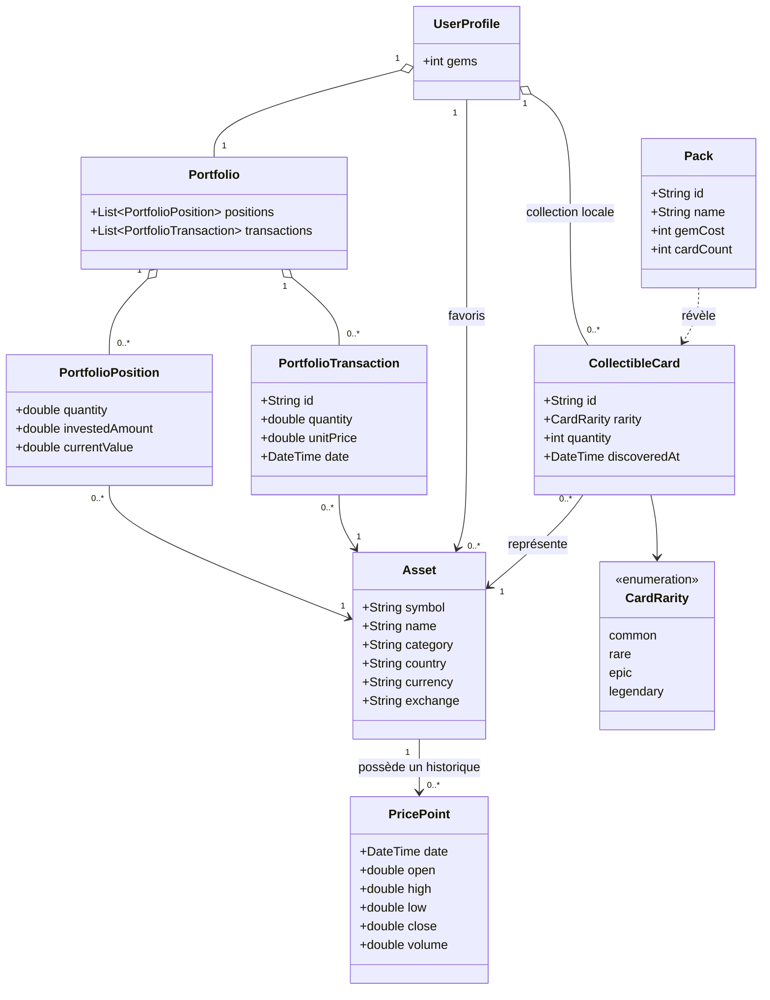

# Modèle de domaine

Le modèle ci-dessous exprime les concepts nécessaires au périmètre décidé. Il reste indépendant de Flutter, de l'API et de SQLite.

## Concepts principaux

| Concept | Responsabilité | Statut |
|---|---|---|
| `Asset` | Identité d'une entreprise/action : symbole, nom et métadonnées utiles | **[DÉCIDÉ — FINDECK]** |
| `PricePoint` | Observation de marché datée, au minimum le cours de clôture ; OHLCV si fourni | **[DÉCIDÉ — FINDECK]** |
| `CollectibleCard` | Carte possédée qui référence un actif, une rareté, une quantité et une découverte | **[DÉCIDÉ — FINDECK]** |
| `CardRarity` | Common, Rare, Epic ou Legendary | **[DÉCIDÉ — FINDECK]** |
| `Pack` | Définition d'un pack : identifiant, nom, coût en gemmes, nombre de cartes | **[DÉCIDÉ — FINDECK]** ; valeurs **[À DÉCIDER]** |
| `UserProfile` | Solde local de gemmes | **[DÉCIDÉ — FINDECK]** |
| `PortfolioTransaction` | Achat fictif daté : actif, quantité et prix unitaire | **[DÉCIDÉ — FINDECK]** |
| `PortfolioPosition` | Vue calculée et agrégée des opérations pour un actif | **[DÉCIDÉ — FINDECK]** |
| `Portfolio` | Ensemble de positions et opérations fictives | **[DÉCIDÉ — FINDECK]** |

Un favori est une relation locale entre l'utilisateur unique de l'appareil et un `Asset`. Il n'a pas besoin d'une entité métier complexe tant qu'aucun compte distant n'existe.

## Diagramme de classes conceptuel

## Invariants métier

- Un symbole d'actif est normalisé et non vide.
- Une quantité de carte ne peut pas être négative.
- Le coût d'un pack et le solde de gemmes sont des entiers non négatifs.
- L'achat d'un pack doit débiter les gemmes et ajouter les cartes dans une même transaction locale.
- Une opération de portefeuille exige une quantité et un prix strictement positifs.
- Une rareté ne modifie aucun calcul financier.
- Une position est dérivée des opérations ; elle ne doit pas contredire leur somme.
- Les calculs utilisent la devise de l'actif telle qu'affichée. Aucune conversion de devise n'est prévue dans le périmètre actuel.

## Réalisé pour les calculs

Au 23 septembre 2026, seuls les modèles utiles aux formules existent. Ce ne sont pas encore les entités persistées.

- `Purchase` : symbole, quantité, prix unitaire et devise d'un achat fictif valide. Le symbole et la devise sont normalisés en majuscules. L'identifiant et la date de `PortfolioTransaction` ne sont pas encore modélisés.
- `MarketQuote` : cours éventuellement absent pour un symbole et une devise.
- `PositionValuation`, `CurrencyBook` et `PortfolioValuation` : résultats calculés, pas des données saisies. Les listes de positions, de sous-totaux et de poids sont copiées et non modifiables.

`Asset`, `PricePoint`, les cartes, les packs, les gemmes et le portefeuille persisté ne sont pas implémentés. Une position affichée ne contredit pas les achats, parce qu'elle est uniquement dérivée d'eux.

Le type numérique des calculs est `double`. L'arrondi d'affichage reste ouvert.

## Détails non figés

**[À DÉCIDER]**

- champs optionnels exacts de `Asset`, notamment logo et description selon la source autorisée ;
- catégorie sous forme de chaîne ou d'énumération ;
- gestion future de ventes fictives — seule la saisie d'achats est engagée actuellement ;
- algorithme de tirage des packs et gestion des doublons au-delà de l'incrément de quantité ;
- politique d'arrondi monétaire à l'affichage.
