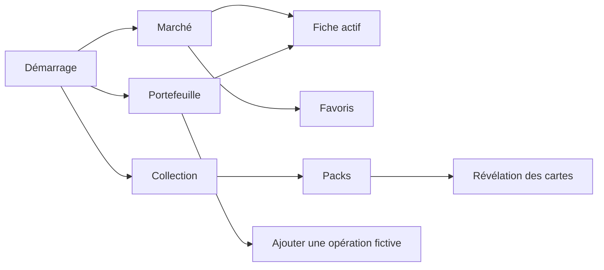

# Navigation et écrans

## Structure retenue

**[IMPOSÉ — SUJET]** Au moins trois écrans significatifs et une navigation sont requis.

**[DÉCIDÉ — FINDECK]** Les trois espaces principaux sont Marché, Collection et Portefeuille. GoRouter gère les routes ; les détails et formulaires sont des routes enfants ou poussées.

## Écrans et responsabilités

| Écran | Contenu principal | États importants | Exigence couverte |
|---|---|---|---|
| Marché | catalogue, recherche, accès aux favoris | chargement, données, vide, erreur, actualisation | liste dynamique, API |
| Fiche actif | identité, dernière valeur, historique, graphique, favori | cache frais/ancien, période vide, erreur | graphique, offline |
| Favoris | actifs suivis localement | vide/renseigné, cours ancien | persistance |
| Collection | cartes possédées, quantité, catégorie, rareté | vide/renseigné | persistance métier |
| Packs | packs disponibles, coût, solde | assez/pas assez de gemmes | état métier |
| Révélation | cartes obtenues lors de l'ouverture | animation en cours/terminée | animation codée |
| Portefeuille | positions, valeur, gains/pertes, répartition | vide/renseigné, prix manquant/ancien | calculs, graphique |
| Ajouter une opération | actif, quantité, prix d'achat, date | validation et erreur d'écriture | formulaire validé |

## Formulaire du portefeuille

**[DÉCIDÉ — FINDECK]** Le formulaire d'ajout d'un achat fictif couvre l'exigence de validation.

Règles minimales :

- actif sélectionné et connu ;
- quantité numérique strictement positive ;
- prix d'achat numérique strictement positif ;
- date valide, non vide et non située dans le futur sans justification ;
- messages d'erreur près des champs ;
- aucune écriture si le formulaire est invalide ;
- après succès, retour clair au portefeuille actualisé.

## Navigation hors ligne

Les routes restent accessibles sans réseau. Un écran dont les données n'ont jamais été mises en cache affiche un état d'erreur explicite ; il ne redirige pas silencieusement. Les écrans locaux — collection, favoris et portefeuille — restent consultables.

## Choix provisoires du socle

**[DÉCIDÉ — FINDECK]** En attendant les maquettes, le socle utilise :

- une barre inférieure Material 3 ;
- les routes `/market`, `/collection` et `/portfolio` ;
- `/market` comme écran initial.

Ces trois pages annoncent explicitement que leur contenu n'est pas développé. Les routes enfants — fiche, favoris, packs, révélation et formulaire — ne sont pas créées. Aucun écran Profil ou Paramètres avancés n'est engagé. Le regroupement Favoris/Marché reste ouvert.
