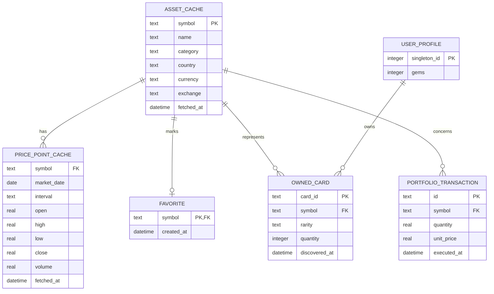

# Modèle de données et persistance locale

## Choix de stockage

**[DÉCIDÉ — FINDECK]**

- SQLite via `sqflite` pour les données structurées, relations, transactions atomiques et cache persistant ;
- `SharedPreferences` uniquement pour de petites préférences d'interface si nécessaire ;
- aucune base distante ni backend pour la première version.

## Séparation obligatoire

| Données utilisateur | Cache provenant d'Internet |
|---|---|
| favoris | métadonnées d'actifs |
| cartes possédées | dernières cotations connues |
| solde de gemmes | historiques de prix |
| opérations du portefeuille fictif | horodatages d'actualisation |

Cette séparation permet de purger ou renouveler un cache sans perdre les données de l'utilisateur.

Une fiche d'actif référencée par un favori, une carte ou une opération doit toutefois être conservée : le schéma ci-dessous relie ces enregistrements à `ASSET_CACHE`. Une purge des prix ne doit pas supprimer ces relations ni déclencher une suppression en cascade des données utilisateur. La règle de rétention des fiches non référencées reste à définir avant la base de données.

## Schéma relationnel cible

Pour `PRICE_POINT_CACHE`, la contrainte logique unique est `(symbol, market_date, interval)`. Les positions sont calculées à partir des opérations et ne sont pas dupliquées dans une table au départ.

Ce diagramme est conceptuel. La relation du profil à la collection exprime l'utilisateur local unique, sans compte distant. Les types physiques et contraintes seront définis lors de la création de la base.

**[À DÉCIDER]** La dernière cotation est prévue dans les flux, mais sa table dédiée n'est pas encore décrite ici. Avant l'intégration, définir son prix, sa devise, son instant de marché et son instant de récupération ; ne pas confondre ces deux dates. Vérifier aussi si un symbole suffit à identifier un instrument dans le catalogue choisi : des places de cotation différentes peuvent nécessiter une clé composée ou un identifiant interne.

## Transactions atomiques

- Ouvrir un pack : vérifier le solde, débiter les gemmes et insérer/incrémenter toutes les cartes dans une seule transaction SQLite.
- Ajouter une opération fictive : écrire l'opération complète ou ne rien écrire.
- Basculer un favori : l'état publié doit correspondre à l'écriture confirmée.

## Dates et fraîcheur

- stocker les instants techniques (`fetched_at`, `created_at`) dans un format cohérent et documenté ;
- conserver séparément la date de marché d'un point historique et la date de récupération ;
- afficher à l'utilisateur l'heure locale de dernière actualisation ;
- ne jamais déduire qu'une donnée est fraîche uniquement parce que l'application vient de démarrer.

## Migrations

La base doit posséder un numéro de version dès sa création. Toute modification de schéma passe par une migration explicite et testée ; supprimer la base de l'émulateur n'est pas une stratégie de migration.

## Points à décider avant implémentation

**[À DÉCIDER]**

- nom physique de la base et version initiale ;
- champs optionnels exacts d'un actif selon l'API réellement accessible ;
- solde initial de gemmes ;
- source locale de la définition des packs (constantes validées ou table) ;
- conservation éventuelle d'un historique d'ouvertures — non requis actuellement ;
- type et règle d'arrondi pour les montants.
