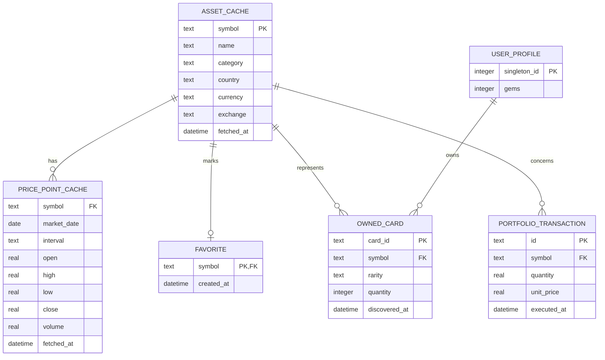

# Modèle de données et persistance locale

## Choix de stockage

**[DÉCIDÉ — FINDECK]**

- SQLite via `sqflite` pour les données structurées, relations, transactions atomiques et cache persistant ;
- `SharedPreferences` uniquement pour de petites préférences d'interface si nécessaire ;
- aucune base distante ni backend pour la première version.

## Séparation obligatoire

| Données utilisateur | Cache provenant d'Internet |
|---|---|
| favoris | métadonnées d'actifs |
| cartes possédées | dernières cotations connues |
| solde de gemmes | historiques de prix |
| opérations du portefeuille fictif | horodatages d'actualisation |

Cette séparation permet de purger ou renouveler un cache sans perdre les données de l'utilisateur.

Une fiche d'actif référencée par un favori, une carte ou une opération doit toutefois être conservée : le schéma cible ci-dessous relie ces enregistrements à `ASSET_CACHE`. Une purge des prix ne doit pas supprimer ces relations ni déclencher une suppression en cascade des données utilisateur. La rétention des fiches de cache non référencées reste à définir. Dans la base utilisateur actuelle, retirer un favori ne supprime pas la ligne `user_asset`.

## Schéma relationnel cible



Pour `PRICE_POINT_CACHE`, la contrainte logique unique est `(symbol, market_date, interval)`. Les positions sont calculées à partir des opérations et ne sont pas dupliquées dans une table au départ.

Ce diagramme est conceptuel. La relation du profil à la collection exprime l'utilisateur local unique, sans compte distant. Il décrit encore le cache, les cartes, les gemmes et le profil, qui ne sont pas créés.

**[À DÉCIDER]** La dernière cotation est prévue dans les flux, mais sa table dédiée n'est pas encore décrite ici. Avant l'intégration, définir son prix, sa devise, son instant de marché et son instant de récupération ; ne pas confondre ces deux dates. La clé du futur cache reste ouverte. La base utilisateur déjà créée n'utilise pas le symbole seul comme identifiant.

## Schéma réalisé — version 1

**[DÉCIDÉ — FINDECK]** La base ouverte par l'application s'appelle `findeck.db`. Elle est placée dans le répertoire persistant fourni par sqflite. Sa version initiale est 1. L'ouverture active `PRAGMA foreign_keys = ON`, crée le schéma et applique ensuite uniquement des migrations explicites. Une version cible non prise en charge est refusée avant toute création ou modification. Une base déjà marquée d'une version plus récente est refusée sans changer son fichier, son schéma, ses données ni son numéro. Une migration inconnue échoue de la même façon. Le fichier n'est jamais supprimé pour compenser un changement de schéma.

Cette base ne contient que des données utilisateur. Elle ne contient ni cache de marché, ni carte, ni gemme, ni donnée de démonstration. L'application ne l'ouvre pas encore au démarrage : les écrans ne lisent pas ces tables.

```text
user_asset (
  id TEXT PRIMARY KEY,
  symbol TEXT NOT NULL,
  exchange TEXT NOT NULL,
  UNIQUE (symbol, exchange)
)

favorite (
  asset_id TEXT PRIMARY KEY,
  created_at TEXT NOT NULL,
  FOREIGN KEY (asset_id) REFERENCES user_asset (id)
)

portfolio_purchase (
  id TEXT PRIMARY KEY,
  asset_id TEXT NOT NULL,
  quantity REAL NOT NULL,
  unit_price REAL NOT NULL,
  currency TEXT NOT NULL,
  executed_at TEXT NOT NULL,
  FOREIGN KEY (asset_id) REFERENCES user_asset (id)
)
```

`id` est un identifiant local. `exchange` vide signifie que la place de cotation n'est pas connue. Les dates sont des chaînes ISO 8601 en UTC. Aucune valeur, aucun gain et aucune performance ne sont stockés. Les clés étrangères n'ont pas de suppression en cascade.

L'enregistrement d'un achat ou d'un favori écrit la référence d'actif et la ligne utilisateur dans une seule transaction. Un second favori du même couple symbole/place ne crée pas de deuxième ligne. Une validation refusée n'ouvre pas cette transaction.

Les tests utilisent des fichiers temporaires. La sonde Android utilise `findeck_sqlite_probe.db`, puis supprime uniquement ce fichier.

## Transactions atomiques

- Ouvrir un pack : vérifier le solde, débiter les gemmes et insérer/incrémenter toutes les cartes dans une seule transaction SQLite.
- Ajouter une opération fictive : écrire l'opération complète ou ne rien écrire.
- Basculer un favori : l'état publié doit correspondre à l'écriture confirmée.

## Dates et fraîcheur

- stocker les instants techniques (`fetched_at`, `created_at`, `executed_at`) dans un format cohérent et documenté ;
- les dates déjà persistées (`created_at`, `executed_at`) sont des chaînes ISO 8601 produites depuis un `DateTime` converti en UTC, puis relues en UTC ;
- conserver séparément la date de marché d'un point historique et la date de récupération ;
- afficher à l'utilisateur l'heure locale de dernière actualisation ;
- ne jamais déduire qu'une donnée est fraîche uniquement parce que l'application vient de démarrer.

## Migrations

La base doit posséder un numéro de version dès sa création. Toute modification de schéma passe par une migration explicite et testée ; supprimer la base de l'émulateur n'est pas une stratégie de migration.

## Points à décider avant implémentation

**[À DÉCIDER]**

- champs optionnels exacts d'un actif selon l'API réellement accessible ;
- solde initial de gemmes ;
- source locale de la définition des packs (constantes validées ou table) ;
- conservation éventuelle d'un historique d'ouvertures — non requis actuellement ;
- type et règle d'arrondi pour les montants.
